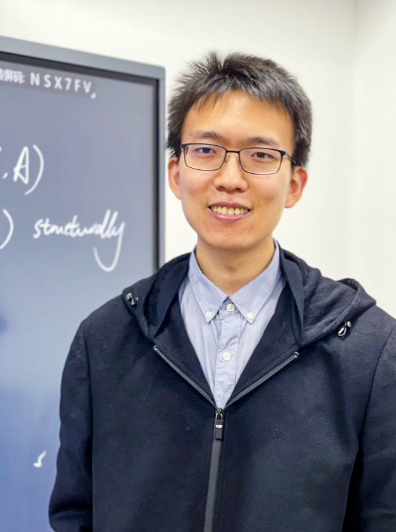

<link rel="stylesheet" href="styles.css">

  

    <h1 class="hero-title">AIAA 6102 Artificial Intelligence Seminar II</h1>
    
Exploring Cutting-Edge AI Technologies and Applications

    

      

        12
        Invited Speakers
      

      

        8
        Session Videos
      

      

        24
        Credit Hours
      

    

  

## 🎯 Course Overview

This seminar aims to deeply explore the latest developments in artificial intelligence, inviting industry experts and academic leaders to share their research findings and practical experiences. Through theoretical lectures, case studies, and interactive discussions, participants will gain a comprehensive understanding of the current state and future trends of AI technology.

## 🎓 Seminar Sessions

  

    

      
Episode 1

      

        
      

      

        <h3>Dr. Muhan Zhang</h3>
        
Institute for Artificial Intelligence, Peking University

        

          Graph Neural Networks
          Machine Learning
          Large Language Models
        

      

      

        5
        September
        13:30-14:20
        Room 102, E4
      

    

    

      

        <h4>Title: TransMLA: Multi-Head Latent Attention Is All You Need</h4>
        
We present TransMLA, a framework that seamlessly converts any GQA-based pre-trained model into an MLA-based model. Our approach enables direct compatibility with DeepSeek's codebase, allowing these models to fully leverage DeepSeek-specific optimizations such as vLLM and SGlang. By compressing 93% of the KV cache in LLaMA-2-7B, TransMLA achieves a 10.6x inference speedup at an 8K context length while preserving meaningful output quality. Additionally, the model requires only 6 billion tokens for fine-tuning to regain performance on par with the original across multiple benchmarks. TransMLA offers a practical solution for migrating GQA-based models to the MLA structure. When combined with DeepSeek's advanced features, such as FP8 quantization and Multi-Token Prediction, even greater inference acceleration can be realized.

      

      

        <h4>Bio</h4>
        
Dr. Muhan Zhang is an assistant professor and assistant to the dean at Institute for Artificial Intelligence, Peking University. He is recipient of the National Excellent Youth (Overseas) Project, and Boya and Weiming Young Scholars of Peking University. He graduated from the IEEE pilot class of Shanghai Jiao Tong University in 2015 and obtained his Ph.D. in Computer Science from Washington University in St. Louis in 2019. From 2019 to 2021, he was a research scientist at Meta AI. He was awarded the AI 2000 most influential scholar honorable mentions by Aminer, and Elsevier top 2% scientist worldwide for multiple years. As a pioneer researcher of Graph Neural Networks, his DGCNN algorithm for graph classification was selected as one of the top ten most influential papers at AAAI-2018 and has been cited over 2000 times. His SEAL algorithm for link prediction significantly broadened the applicability of GNNs on multi-node tasks and has been cited over 2500 times. He regularly serves as an area chair for NeurIPS, ICML, ICLR and other top conferences, and he is a reviewer for top journals such as JMLR, TPAMI, TNNLS, TKDE, TSP, AOAS, and JAIR. He teaches Machine Learning and Introduction to Artificial Intelligence at Peking University.

      

      

        

          
          

            ▶
          

        

        

          
Duration: 90 minutes

          
Deep dive into AI basic concepts, development history, and future trends, laying the foundation for subsequent topic discussions.

          <a href="#" class="watch-button">Watch Video</a>
        

      

    

  

## 📞 Contact Us

  

    <h4>Course Coordinator</h4>
    
📧 Email: aiaa6102@university.edu

    
📱 Phone: +86 123-4567-8900

    
📍 Address: Main Building A101

  

  
  

    <h4>Send Message</h4>
    <form>
      <input type="text" placeholder="Your Name" required>
      <input type="email" placeholder="Email Address" required>
      <textarea placeholder="Please enter your message..." rows="4"></textarea>
      <button type="submit">Send Message</button>
    </form>
  

---

*© 2024 AIAA 6102 Artificial Intelligence Seminar II. All rights reserved.*

